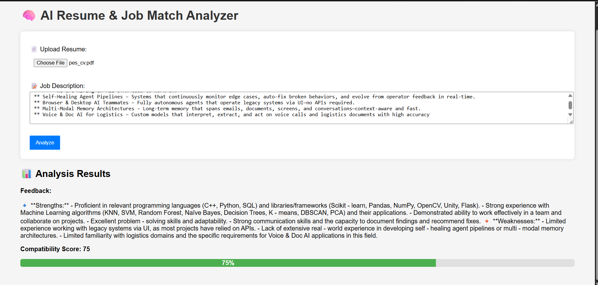

# 🧠 AI Resume & Job Match Analyzer

A lightweight, privacy-first tool that compares your resume to a job description using local LLMs — no internet or API required.

🔒 **Runs fully offline with Mistral via [Ollama](https://ollama.com/)**  
💡 Built using Flask, PyMuPDF, python-docx, and open-source models.

---

## ✨ Features

- 📄 Analyze resumes in `.pdf`, `.docx`, or `.txt` format
- 🤖 Uses **local mistral model via Ollama** for LLM processing
- 💬 Gives **natural language feedback** on your resume
- 📊 Provides a **compatibility score (out of 100)**
- 💻 Simple and intuitive Flask web interface

---




## 🧰 Tech Stack

| Layer | Tech |
|-------|------|
| Web App | Python 3.11+, Flask |
| LLM Inference | Ollama + Mistral |
| Resume Parsing | PyMuPDF, python-docx |
| UI | HTML, CSS (basic) |

---

## 🚀 Getting Started

### 1. Clone the repo
```bash
git clone https://github.com/shivam1342/AI-resume-analyzer.git
cd AI-resume-analyzer
2. Create and activate virtual environment

python -m venv venv
source venv/bin/activate  # Linux/macOS
venv\Scripts\activate     # Windows

pip install -r requirements.txt

3. Install Ollama and run Mistral
Download Ollama, then run:


ollama run mistral
4. Launch the app

python app.py
Open in your browser: http://127.0.0.1:5000


🧠 How It Works
The app:

Extracts resume text using PyMuPDF or python-docx

Accepts a job description via textarea

Sends both to the local mistral LLM with a prompt like:


You are an AI assistant...
Provide:
1. Resume feedback
2. Compatibility score out of 100
Displays output in the UI — no external APIs used!

🧾 Requirements

Flask
PyMuPDF
python-docx
ollama

🙌 Credits
Built by Shivam Singh as part of a personal portfolio.
Feel free to fork, improve, or suggest new features!
